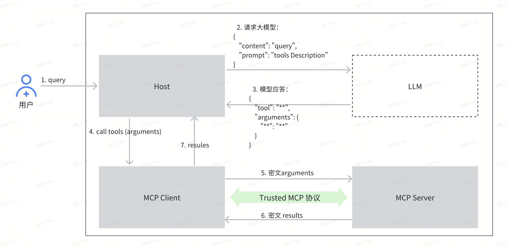

# 1. Trusted MCP介绍
   Trusted MCP是火山引擎推出的可信MCP解决方案，它在MCP协议的基础上，为MCP的核心组件提供了身份证明及验证能力，并提供了端到端的通信加密解决方案，确保MCP核心组件身份可信及通信安全，解决了MCP应用中存在的服务身份不可信、数据被篡改、流量劫持、数据隐私泄露等安全威胁。
## 1.1 Trusted MCP协议及与MCP协议的关系
   Trusted MCP对MCP做了扩展，主要是在MCP协议的能力协商阶段，MCP Client和MCP Server会彼此判断对方是否部署在TEE中，并会对对方的远程证明报告进行验证，如果条件满足，会在jsonrpc中标记是否具有可信能力，在Client和Server后续的通信流程中，会根据该标记确定要不要启动通信加密功能。
### Trusted MCP能力协商后的jsonrpc内容如下：
```
> 2025/08/14 22:17:03.000415587  length=216 from=231 to=446
{"method":"initialize","params":{"protocolVersion":"2025-06-18","capabilities":{"experimental":{"trustProtocol":{"name":"AICC","version":"0.1"}}},"clientInfo":{"name":"mcp","version":"0.1.0"}},"jsonrpc":"2.0","id":0}< 2025/08/14 22:17:03.000425236  length=270 from=0 to=269
HTTP/1.1 200 OK\r
date: Thu, 14 Aug 2025 14:17:03 GMT\r
server: uvicorn\r
cache-control: no-cache, no-transform\r
connection: keep-alive\r
content-type: text/event-stream\r
mcp-session-id: f68f8fa34dc54c3cb7f3c1db87b7e5a0\r
x-accel-buffering: no\r
Transfer-Encoding: chunked\r
\r
```
## 1.2 Trusted MCP协议详情


# 2.  Trusted MCP SDK使用说明
## 2.1 SDK编译与安装
### 进入开源代码，执行编译脚本：
```
sh build.sh
```
或
```
uv build
```
进入dist目录，安装SDK
```
version=0.0.1
pip install bytedance_jeddak_trusted_mcp-${version}-py3-none-any.whl
```
## 2.2 使用SDK接入Trusted MCP
让MCP服务支持Trusted MCP协议非常简单，仅需要使用TrustedMcp代替FastMCP，并准备TEE相关的配置即可，其余只需要按照MCP的开发指引进行开发即可，如下所示是获取天气的MCP Server的示例：
```
# Copyright (c) 2025 Beijing Volcano Engine Technology Co., Ltd. and/or its affiliates
# SPDX-License-Identifier: MIT

import asyncio
import uvicorn

from bytedance.jeddak_trusted_mcp import TrustedMcp


weather_mcp = TrustedMcp(name="Weather service")


@weather_mcp.tool()
def get_weather(city: str) -> dict:
    """Get current weather for a city (e.g. "beijing")."""
    import httpx

    return (
        httpx.get(f"https://wttr.in/{city}?format=j1")
        .json()
        .get("current_condition")[0]
    )


async def main() -> None:
    import argparse

    parser = argparse.ArgumentParser()
    parser.add_argument("--host", type=str, default="0.0.0.0")
    parser.add_argument("--port", type=int, default=8000)
    args = parser.parse_args()

    uvicorn_config = uvicorn.Config(
        weather_mcp.streamable_http_app(), host=args.host, port=args.port
    )
    server = uvicorn.Server(uvicorn_config)
    await server.serve()


if __name__ == "__main__":
    asyncio.run(main())
```
为了方便后续调试，这里给出了一个简单的MCP Client的示例代码：
```
# Copyright (c) 2025 Beijing Volcano Engine Technology Co., Ltd. and/or its affiliates
# SPDX-License-Identifier: MIT

# -*- coding: utf-8 -*-
import asyncio
import json
import logging
import os

import httpx
import mcp

from bytedance.jeddak_trusted_mcp import trusted_mcp_client

logging.basicConfig(level=logging.INFO, format="%(levelname)s: %(message)s")

MCP_URL = os.environ.get("MCP_URL", "http://127.0.0.1:8000/mcp")


async def run_chatbot(mcp_session: mcp.ClientSession) -> None:
    """Main chat session handler."""
    tools = (await mcp_session.list_tools()).tools

    pass
    
async def main() -> None:
    """Initialize and run the chat session."""
    async with trusted_mcp_client(MCP_URL) as mcp_session:
        logging.info("Client initialized")

        await mcp_session.initialize()
        logging.info("MCP session initialized")

        await run_chatbot(mcp_session)
        logging.info("Exiting")


if __name__ == "__main__":
    asyncio.run(main())
```
# 3. Trusted MCP服务运行
一个典型MCP应用主要包含三个模块，即Host、Client和Server，Host收到用户请求后，会请求LLM解析用户请求，并将其转化为结构化的工具调用输入，然后传输给Client。接下来，Client依据 Trusted MCP 协议，将密文参数传输给Server，得到对应的密文结果。随后，Client 会解密并把明文结果返回给用户。
<br/>

<br/>
Trusted MCP服务运行最佳实践是将各模块，包括大模型服务都运行在TEE环境中，这样能提供最完备的安全保障，但为了方便调试及功能验证，同时也支持将Trusted MCP服务运行在普通的非TEE环境中，在普通环境中运行时，Trusted MCP SDK仅为Client和Server提供机密通信能力。
## 3.1 在普通环境中运行MCP服务
首先，准备好一个RSA公私钥对（也可以通过openssl工具生成）
```
openssl genrsa -out ./myPrivateKey.pem 4096
openssl rsa -pubout -in ./myPrivateKey.pem -out ./myPublicKey.pem
```
启动Server（以https://github.com/volcengine/AICC-Trusted-MCP/blob/main/demo/server.py为例）
```
python server.py
```

启动Host以及Client（以https://github.com/volcengine/AICC-Trusted-MCP/blob/main/demo/local_client.py为例）
```
python local_client.py
# 注：运行前需要配置Server以及方舟模型信息等相关环境变量
# MCP_URL：MCP server地址，可选，缺省默认是http://127.0.0.1:8000/mcp
# LLM_API_KEY：火山方舟的API Key，必须，如果没有可以联系火山获取一个临时的API Key
# LLM_MODEL_NAME：方舟模型名称，可选，缺省默认是doubao-1.5-pro-32k-250115
```

## 3.2 在TEE环境中运行MCP服务
当Trusted MCP服务部署在TEE环境中时，Client和Server会彼此验证对方的远程证明报告，我们以火山引擎的TEE AI机密计算平台AICC产品为例
### 1. 准备AICC配置
火山AK、SK请联系[火山引擎AICC](https://www.volcengine.com/docs/85010/1408106?lang=zh)获取
将AK、SK填到Client和Server的配置文件中，参考
[./demo/client_config.json](https://github.com/volcengine/AICC-Trusted-MCP/blob/main/demo/client_config.json) 以及
[./demo/server_config.json](https://github.com/volcengine/AICC-Trusted-MCP/blob/main/demo/server_config.json)
```
{
   "ra_service_name": "**", //服务在AICC中部署时的名称
   "ra_policy_id": "**", //证明验证的policy信息
   "ra_uid": "2100xxxxxx", //火山引擎账号ID
   "bytedance_top_info": "{\"url\": \"open.volcengineapi.com\", \"ak\": \"***\", \"sk\": \"****\"}"
}
```
MCP Server运行配置
```
{
   "tks_url": "***", //火山top网关地址
   "tks_app_id": "2100xxxxxx",//火山引擎账号ID
   "bytedance_top_info": "{\"ak\": \"***\", \"sk\": \"***\"}",
   "refresh_interval": 3600
}
```
### 2. 准备Client和Server，参考[./demo/aicc_client.py](https://github.com/volcengine/AICC-Trusted-MCP/blob/main/demo/aicc_client.py) 及 [./demo/aicc_server.py](https://github.com/volcengine/AICC-Trusted-MCP/blob/main/demo/aicc_server.py)
### 3. 在TEE环境中部署Client和Server，详见[火山引擎AICC](https://www.volcengine.com/docs/85010/1408106?lang=zh)
### 4. 启动Server和Client
```
python ./demo/aicc_server.py
python ./demo/aicc_client.py
```
# 致谢
   感谢本项目成员，没有大家的共同努力，不会有这个项目的开源发布。希望本项目能对AI应用的隐私保护，特别是在涉及端云协作的场景下，迈出探索性的一步。
# license
   MIT。
