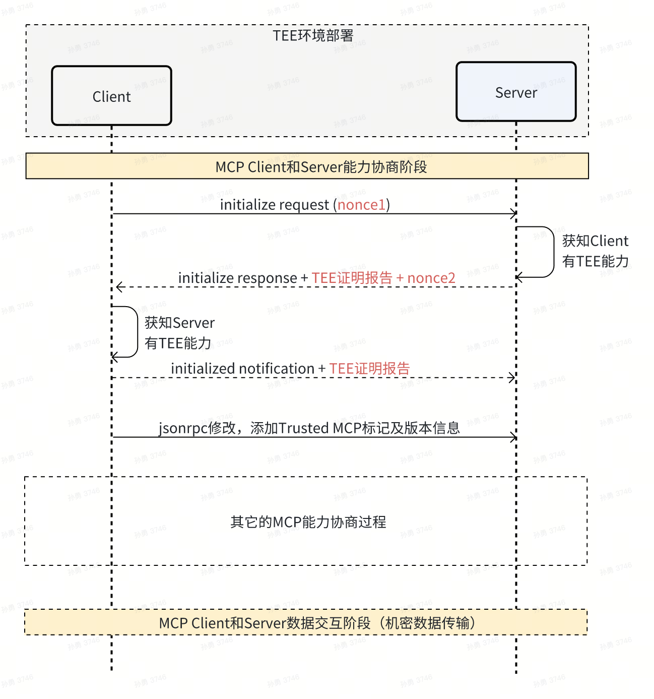

<div align="center">

<strong>Trusted Model Context Protocol (Trusted MCP)</strong>
<!-- [](https://pypi.org/project/trustedmcp/)    -->
<!-- [](./README.md) -->

[](https://pypi.org/project/trustedmcp/)  [](./LICENSE)  [](https://www.python.org/downloads/release/python-310/)  [](https://modelcontextprotocol.io/)


</div>

## 什么是Trusted MCP？

Trusted MCP是火山引擎推出的可信MCP，在[标准MCP协议](https://modelcontextprotocol.io/)的基础上扩展核心组件之间的身份证明及验证能力，提供组件之间端到端的通信安全保障，可以解决MCP应用中服务身份不可信、数据被篡改、流量劫持、数据隐私泄露等安全威胁。

<p align="center">
  
</p>

## 安装

推荐使用 [uv](https://docs.astral.sh/uv/getting-started/installation/#installing-uv) 进行Python项目管理（支持Python 3.11及以上版本）。

```bash
uv add trustedmcp
```
或者，对于使用 pip 管理依赖的项目：

```bash
pip install trustedmcp
```

## 快速开始

在代码中引入TrustedMCP，仅需要将现有MCP模块替换成TrustedMCP模块即可。如下代码展示：

```python
# Original MCP code
# Import MCP, and create an MCP server
from mcp.server.fastmcp import FastMCP
mcp = FastMCP(name="Demo")

# Replace with TrustedMCP code
# Import TrustedMCP, and create a TrustedMCP server
from bytedance.jeddak_trusted_mcp import TrustedMCP
trusted_mcp = TrustedMCP(name="Demo")
```

注意：实际代码运行还需要提供TrustedMCP以及大模型调用的必要配置。

## 如何部署和运行Trusted MCP服务

典型MCP应用通常主要包含三个模块，即Host、Client和Server，Client和Server可以灵活部署。Trusted MCP支持在普通环境（非机密环境）中运行，同时也支持在机密环境中运行。在普通环境中运行时，Trusted MCP仅为Client和Server提供端到端的机密通信能力，而在机密环境中运行时，Trusted MCP还能够提供远程证明验证，确保对端运行在机密计算环境、且服务可信。

> 推荐：开发调试以及功能验证可在普通环境下部署更方便，生产环境下建议部署到机密计算环境以提供最完备的安全保障。

### 部署到普通环境

以本地部署demo目录下的[server.py](./demo/server.py)和[client.py](./demo/local_client.py)为例，展示如何在普通环境中部署Trusted MCP服务。

1. 环境配置
    ```bash
    # 生成公私钥对，此处openssl生产RSA公私钥对为例：
    openssl genrsa -out ./myPrivateKey.pem 4096
    openssl rsa -pubout -in ./myPrivateKey.pem -out ./myPublicKey.pem

    # 注：
    # 1. 此处生成的公私钥对仅用于演示，在生产环境中请使用安全的密钥管理方案。
    # 2. 公私钥对需要分别配置到Client和Server中，Client的公钥需要配置到Server中，Server的公钥需要配置到Client中。
    ```

2. 部署启动Server
    ```bash
    # 配置Server运行环境
    # 1. 配置Server私钥，缺省默认使用目录下的 ./myPrivateKey.pem
    # 2. 配置Server的地址，缺省默认是 http://127.0.0.1:8000/mcp
    uv run python server.py
    ```
    
3. 部署启动Client
    ```bash
    # 配置Client运行环境
    # 1. 配置Client公钥，缺省默认使用目录下的 ./myPublicKey.pem
    # 2. 配置Server的地址，缺省使用默认地址 http://127.0.0.1:8000/mcp
    # 3. 配置火山方舟的API Key环境变量 LLM_API_KEY，如果没有可以联系火山引擎获取一个临时的API Key
    # 4. 配置火山方舟的模型名称环境变量 LLM_MODEL_NAME，缺省默认使用 doubao-1.5-pro-32k-250115
    uv run python local_client.py
    ```

完成以上步骤后，即可在普通环境中运行Trusted MCP服务，可在Client中输入任意请求（如查询北京天气）。

### 部署到机密计算环境

以在火山引擎AICC机密计算平台部署demo目录下的[aicc_server.py](./demo/aicc_server.py)和[aicc_client.py](./demo/aicc_client.py)为例，展示如何在机密计算环境中部署Trusted MCP服务。

1. 准备机密计算环境

    请参考[火山引擎AICC](https://www.volcengine.com/docs/85010/1408106?lang=zh)文档，开通机密计算实例，并记录相关信息，如实例ID、AK、SK等。

2. 配置环境

   编辑Server和Client的配置文件（[server_config.json](./demo/server_config.json)和[client_config.json](./demo/client_config.json)）中，将机密计算环境相关信息进行更新，如实例ID、AK、SK等。

3. 部署启动Server
    ```bash
    # 配置Server运行环境
    # 1. 配置Server配置文件路径，缺省默认使用目录下的 ./server_config.json
    # 2. 配置Server的地址
    uv run python aicc_server.py
    ```

4. 部署启动Client
    ```bash
    # 配置Client运行环境
    # 1. 配置Client配置文件路径，缺省默认使用目录下的 ./client_config.json
    # 2. 配置Server的地址
    # 3. 配置火山方舟的API Key环境变量 LLM_API_KEY
    # 4. 配置火山方舟的模型名称环境变量 LLM_MODEL_NAME
    uv run python aicc_client.py
    ```

完成以上步骤后，即可在机密计算环境中运行Trusted MCP服务，可在Client中输入任意请求（如查询北京天气）。

## 致谢
   感谢[火山引擎AICC](https://www.volcengine.com/docs/85010/1408106?lang=zh)项目组成员，倘若没有项目组成员的努力，该项目无法实现开源发布。期望本项目能够在AI智能体隐私保护领域，特别是在涉及用户数据安全的场景中，贡献一份力量。

## 许可证
   MIT。
